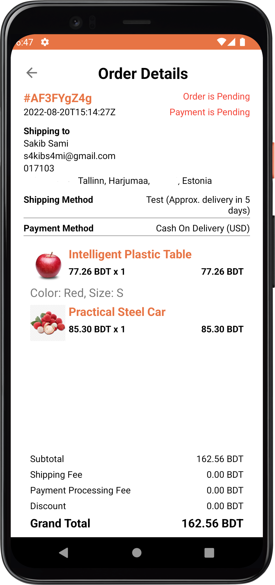

# Shopemaa Android Storefront

Android eCommerce storefront app based on [Shopemaa eCommerce Platform](https://shopemaa.com).

## Platform [shopemaa.com](https://shopemaa.com)

Shopemaa provides On-demand online store with headless API.

## How it works

1. Create a store in [Shopemaa](https://shopemaa.com)
2. Generate store QR code
3. Install and open android app. You will be asked to scan the store QR code
4. Scan QR code and store credentials will be saved in device and you will be able to browse store
   products, categories and orders

## How it looks

* Home
  
* Cart
  
* Order Details
  

* Shopemaa Dashbord
  
* Shopemaa Store Dashbord
  

# Contact

Shopemaa Support: support@shopemaa.com

# License

Licensed under the [MIT License](./license.tx)
